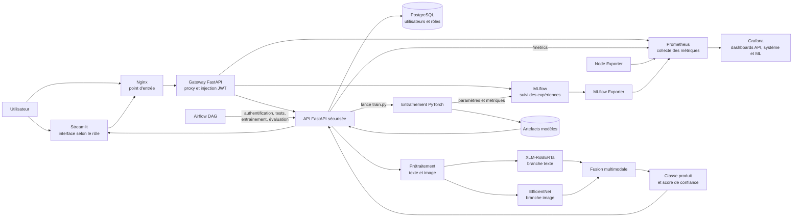

# Rakuten Multimodal MLOps

Projet MLOps de classification multimodale combinant texte et image pour la catégorisation de produits Rakuten.

## Description

Cette API utilise des modèles de Machine Learning pour classifier des produits en combinant :
- **Texte** : Description et désignation du produit (Transformer XLM-Roberta)
- **Image** : Photo du produit (EfficientNet)
- **Fusion multimodale** : Classification finale combinant les deux modalités

## Architecture

```
RAKUTEN_MLOPS
├── docker-compose.yml
├── requirements.txt
├── config.py
├── src/fastapi1/
│   ├── main.py
│   └── endpoints/
│       ├── test_api.py
│       └── prediction_api.py
├── models/
│   ├── rakuten_efficientnet_image/
│   ├── rakuten_transformer_text/
│   └── multimodal_transformer_classifier/
├── dataset/
└── tests/
    ├── conftest.py
    ├── test_basic_endpoint.py
    └── test_prediction_endpoint.py
```

### Schéma de fonctionnement



## Démarrage rapide

### 1. Prérequis
- Docker & Docker Compose
- Accès aux artefacts DVC pour restaurer `dataset/` et les modèles
- Fichier `.env` local créé depuis `.env.example`

```bash
cp .env.example .env
# Éditer ensuite les valeurs sensibles dans .env
```

> Important : `.env` ne doit jamais être versionné. Si une valeur sensible a déjà été exposée, elle doit être changée/rotatée.

### 2. Lancement de l'API
```bash
# Démarrer l'API
docker compose up -d

# Vérifier que l'API fonctionne
curl http://127.0.0.1:8000/predict/health
```

### 3. Test de prédiction
```bash
curl -X POST "http://127.0.0.1:8000/predict/multimodal" \
  -F "text=jeu de plateau de société" \
  -F "image=@./dataset/images/image_test/image_example.jpg"
```

## Tests

### Lancement des tests

#### Tests complets
```bash
# Tous les tests
docker exec rakuten_api pytest /app/tests/ -v

# Tests avec résumé court
docker exec rakuten_api pytest /app/tests/ -v --tb=short
```

#### Tests par catégorie
```bash
# Tests des endpoints de base uniquement
docker exec rakuten_api pytest /app/tests/test_basic_endpoint.py -v

# Tests des prédictions uniquement  
docker exec rakuten_api pytest /app/tests/test_prediction_endpoint.py -v
```

#### Tests spécifiques
```bash
# Test de santé des modèles
docker exec rakuten_api pytest /app/tests/test_basic_endpoint.py::TestHealthEndpoints::test_health_endpoint -v

# Test de prédiction réussie
docker exec rakuten_api pytest /app/tests/test_prediction_endpoint.py::TestPredictionSuccess::test_valid_prediction -v

# Tests d'un endpoint spécifique
docker exec rakuten_api pytest /app/tests/test_basic_endpoint.py::TestRootEndpoints -v
```

#### Tests avec détails d'erreurs
```bash
# Voir les détails complets des échecs
docker exec rakuten_api pytest /app/tests/ -v --tb=long

# Mode silencieux (résultats seulement)
docker exec rakuten_api pytest /app/tests/ -q
```

#### Tests en mode interactif
```bash
# Accéder au container pour debugging
docker exec -it rakuten_api bash

# Dans le container :
pytest /app/tests/ -v
pytest /app/tests/test_basic_endpoint.py::TestHealthEndpoints -v -s
```

## Résultats attendus des tests

Après exécution, vous devriez voir :
```
============================= test session starts ==============================
collected 32 items

tests/test_basic_endpoint.py::TestRootEndpoints::test_test_endpoint PASSED
tests/test_basic_endpoint.py::TestHealthEndpoints::test_health_endpoint PASSED
tests/test_basic_endpoint.py::TestHealthEndpoints::test_model_info_endpoint PASSED
tests/test_prediction_endpoint.py::TestPredictionSuccess::test_valid_prediction PASSED
...

========================= 32 passed in XX.XXs =========================
```

## Endpoints disponibles

### Endpoints de base
- `GET /test` - Test simple de l'API
- `GET /predict/health` - Santé des modèles ML
- `GET /predict/info` - Informations sur les modèles

### Endpoints de prédiction
- `POST /predict/multimodal` - Prédiction texte + image

### Documentation
- `GET /docs` - Documentation Swagger interactive
- `GET /redoc` - Documentation ReDoc

## Commandes utiles

### Gestion des containers
```bash
# Voir les logs de l'API
docker logs rakuten_api -f

# Arrêter l'API
docker compose down

# Reconstruire l'API
docker compose build --no-cache
docker compose up -d
```

### Debug et maintenance
```bash
# Accéder au container
docker exec -it rakuten_api bash

# Voir l'état des modèles
curl http://127.0.0.1:8000/predict/health | python -m json.tool

# Nettoyer tout
docker compose down -v
docker system prune -f
```

## Coverage des tests

Les tests couvrent :
- **Endpoints de base** (santé, informations)
- **Prédictions multimodales** (succès et échecs)
- **Validation des entrées** (texte vide, fichiers invalides)
- **Gestion d'erreurs** (404, 405, 422, 500)
- **Format des réponses** (JSON, types de données)
- **Cas limites** (images corrompues, texte long)

## Troubleshooting

### Tests échouent
```bash
# Vérifier que l'API est démarrée
docker ps | grep rakuten_api

# Vérifier la santé de l'API
curl http://127.0.0.1:8000/predict/health

# Si les tests ont été modifiés, reconstruire l'image
docker compose build --no-cache
docker compose up -d
```

### API ne répond pas
```bash
# Vérifier les logs
docker logs rakuten_api --tail=50

# Redémarrer l'API
docker compose restart api
```

### Supprimer les volumes et images et build 
```bash
docker compose down --volumes --remove-orphans                                                                 
docker system prune --all --volumes --force
docker compose up --build
```

## Technologies utilisées

- **Backend** : FastAPI, Python 3.11
- **ML** : PyTorch, PyTorch Lightning, Transformers
- **Vision** : EfficientNet, OpenCV, Pillow
- **NLP** : XLM-Roberta, NLTK
- **Base de données** : PostgreSQL
- **Containerisation** : Docker, Docker Compose
- **Tests** : Pytest, HTTPx

## Sécurité et hygiène du dépôt

- Les secrets sont fournis via `.env`, ignoré par Git.
- `.env.example` documente les variables attendues sans exposer de vraies valeurs.
- Les datasets et modèles lourds sont suivis via DVC, pas directement dans Git.
- La CI vérifie la syntaxe Python et l'absence de fichiers locaux sensibles comme `.env` ou `.DS_Store`.
